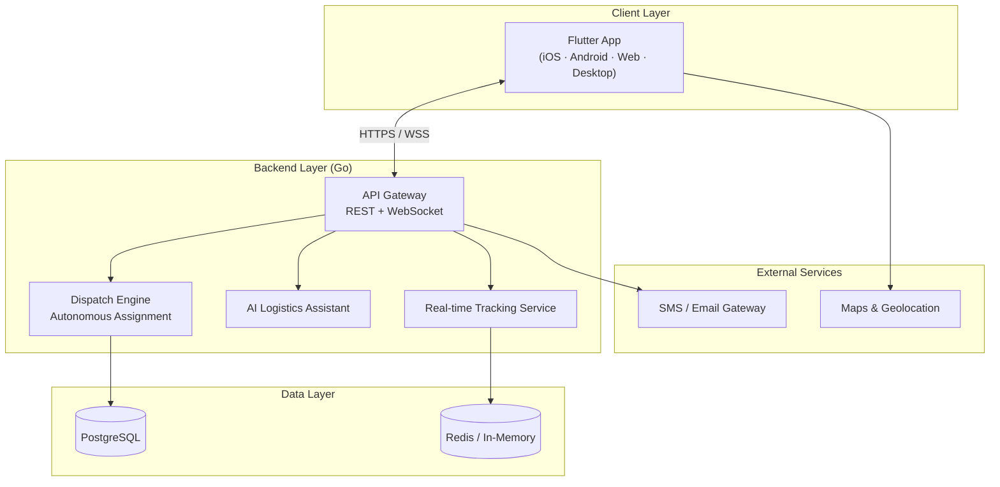

<div align="center">

# LOOP

**AI-powered logistics & delivery management platform for B2B operations**

[](https://flutter.dev/)
[](https://dart.dev/)
[](https://go.dev/)
[](https://riverpod.dev/)
[]()

[Architecture](#-architecture) · [Features](#-features) · [Installation](#-installation--usage) · [Security](#-security-considerations) · [Contributing](./CONTRIBUTING.md)

</div>

---

## Elevator Pitch

**LOOP** replaces fragmented phone/WhatsApp coordination with a single operations hub for delivery and logistics teams. The platform combines real-time fleet tracking, autonomous courier assignment, and an AI logistics assistant — built as a cross-platform Flutter client with a Go backend, currently under review for the **Teknopark İstanbul BIGG / TÜBİTAK BiGG** entrepreneurship program.

---

## Features

| Module | Description |
|--------|-------------|
| **Live Map** | Real-time fleet tracking with interactive order markers and route overlays |
| **Autonomous Assignment** | Nearest-courier matching algorithm with sub-second dispatch simulation |
| **AI Logistics Assistant** | Voice-enabled assistant for traffic analysis and route optimization |
| **Order Tracking Portal** | Customer-facing order status with SMS/email verification flow |
| **B2B Partner Hub** | Multi-partner management, onboarding, and operational dashboards |
| **Client Tracking** | End-customer visibility layer for delivery lifecycle |

---

## Tech Stack

| Layer | Technology |
|-------|------------|
| Mobile / Web | Flutter 3.12, Dart 3.12 |
| State Management | Riverpod, Flutter Hooks |
| Maps | flutter_map, latlong2 |
| Backend (planned) | Go — REST API, WebSocket, concurrency-safe dispatch |
| AI | Logistics Assistant integration (route & traffic analysis) |
| Typography | Google Fonts (Barlow) |

---

## Architecture



### Mobile App Structure

```
lib/
├── screens/          # Feature screens (map, orders, partners, tracking)
├── widgets/          # Reusable UI components
├── state/            # Riverpod providers & app state
├── theme/            # Design system (colors, typography)
├── layouts/          # Shell layouts & navigation
└── utils/            # Localization & helpers
```

---

## Installation & Usage

### Prerequisites

- Flutter SDK ≥ 3.12
- Dart SDK ≥ 3.12
- (Optional) Go ≥ 1.22 for backend development

### Mobile / Desktop Client

```bash
git clone https://github.com/mertturkel234/loop_app.git
cd loop_app
flutter pub get
cp .env.example .env        # configure API endpoints when backend is connected
flutter run
```

### Build for Production

```bash
# Android
flutter build apk --release

# iOS
flutter build ios --release

# Web
flutter build web --release
```

### Docker (Backend — when available)

```bash
# Planned: docker compose up -d
# Backend service will expose REST + WebSocket on port 8080
```

---

## Security Considerations

- **Credential isolation:** API keys and backend URLs are loaded from environment variables via `.env` — never hardcoded in source.
- **Transport security:** All production API communication uses HTTPS/WSS (TLS 1.2+).
- **Authentication:** JWT-based session management planned for B2B partner accounts.
- **Data minimization:** Location data retained only for active delivery windows.
- **Input validation:** All API payloads validated server-side before dispatch operations.

See [SECURITY.md](./SECURITY.md) for vulnerability reporting.

---

## Contributing

We follow [Conventional Commits](https://www.conventionalcommits.org/) and a feature-branch workflow. See [CONTRIBUTING.md](./CONTRIBUTING.md).

---

## Roadmap

| Priority | Feature |
|----------|---------|
| 🔜 | Go backend API + WebSocket live tracking |
| 🔜 | Production courier assignment microservice |
| 🔜 | SMS/email verification integration |
| 🔜 | Docker Compose full-stack deployment |
| 🔜 | E2E test suite (integration + widget tests) |

---

## License

Private — All rights reserved. Commercial use requires explicit permission.

---

<div align="center">

**LOOP** — *Autonomous logistics, delivered.*

Made in Turkey 🇹🇷

</div>
